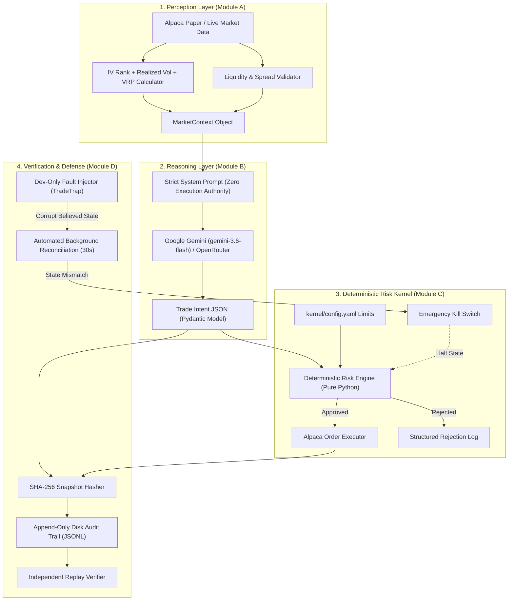

# GlassBox Options — System Architecture & Design Specification

## 1. Core Architectural Boundary

> **The Non-Negotiable Rule**:  
> **"The LLM never talks to Alpaca. The LLM only emits a structured Intent. A deterministic, non-LLM Risk Kernel is the only thing that ever calls the broker."**

---

## 2. The 5 Modules Explained

### Module A — Perception Layer (`perception/`)
* **Purpose**: Gathers market facts upstream of the AI. Zero trading decisions occur here.
* **Key Components**:
  * [alpaca_client.py](file:///c:/hackathone/glassbox%20lab%20ai%20trading%20bot/perception/alpaca_client.py): Pulls live paper account balance, equity, positions, and portfolio Greeks
    (summed from real per-position Greeks). Options chains come from Alpaca's options-contracts
    master list (real strikes/expiries/OCC symbols/open interest), enriched with Alpaca's live
    options quote feed (real bid/ask/IV/Greeks) where a contract has one. When a specific contract
    has no live quote, [options_pricing.py](file:///c:/hackathone/glassbox%20lab%20ai%20trading%20bot/perception/options_pricing.py)
    prices it with Black-Scholes off a real reference price (the contract's last close, or the
    trailing realized-vol proxy) - every quote carries a `quote_source` field disclosing which
    applied. Falls back to a clearly `data_source: "simulated"`-tagged feed only when no broker
    credentials are configured.
  * [vol_metrics.py](file:///c:/hackathone/glassbox%20lab%20ai%20trading%20bot/perception/vol_metrics.py):
    * **IV Rank**: Percentile rank of current Implied Volatility against a trailing realized-vol
      range proxy (a true 52-week *implied*-vol percentile would require a paid historical OPRA
      subscription for a rolling ~3-week contract, which isn't freely available).
    * **Realized Volatility**: Trailing 30-day close-to-close annualized standard deviation, computed from real Alpaca stock bars.
    * **Volatility Risk Premium (VRP)**: $\text{VRP} = \text{IV} - \text{RV}$. When positive, options premium is overpriced and harvesting theta/vega is statistically favored.
  * [liquidity.py](file:///c:/hackathone/glassbox%20lab%20ai%20trading%20bot/perception/liquidity.py): Computes Bid-Ask Spread as a percentage of mid-price: $\text{Spread \%} = \frac{\text{Ask} - \text{Bid}}{\text{Mid}} \times 100\%$.
  * [earnings_calendar.py](file:///c:/hackathone/glassbox%20lab%20ai%20trading%20bot/perception/earnings_calendar.py): Uses Finnhub's free-tier earnings calendar when `FINNHUB_API_KEY` is configured; otherwise falls back to a small static reference table, and honestly reports `unknown_no_data` (never a silent false-negative) for anything outside both sources.

---

### Module B — Reasoning Layer (`reasoning/`)
* **Purpose**: Translates `MarketContext` into a structured options trade proposal (`Intent`).
* **Key Components**:
  * [system_prompt.md](file:///c:/hackathone/glassbox%20lab%20ai%20trading%20bot/reasoning/prompts/system_prompt.md): Explicitly constrains the LLM to output pure JSON following the `Intent` schema. Strictly prohibits external opinions; requires numeric rationale citing only provided market metrics.
  * [agent.py](file:///c:/hackathone/glassbox%20lab%20ai%20trading%20bot/reasoning/agent.py): Multi-provider LLM connector (Google Gemini default, OpenRouter fallback, and deterministic backup). Validates responses against Pydantic schema with fail-closed retry.
  * [regime_classifier.py](file:///c:/hackathone/glassbox%20lab%20ai%20trading%20bot/reasoning/regime_classifier.py): Labels market states (`sell_premium`, `stand_down_high_vix`, `stand_down_earnings`, `neutral`).
  * [blindfold.py](file:///c:/hackathone/glassbox%20lab%20ai%20trading%20bot/reasoning/blindfold.py): The Act 3 anonymization experiment runner. Replaces ticker identifiers (`SPY` $\rightarrow$ `ASSET_04`) to measure model strategy honesty.

---

### Module C — Risk Kernel & Execution (`kernel/`)
* **Purpose**: The deterministic safety gateway with pure non-LLM logic.
* **Key Components**:
  * [config.yaml](file:///c:/hackathone/glassbox%20lab%20ai%20trading%20bot/kernel/config.yaml): Human-readable, versioned safety limits.
  * [risk_kernel.py](file:///c:/hackathone/glassbox%20lab%20ai%20trading%20bot/kernel/risk_kernel.py): Evaluates 10 hard rules:
    1. **Kill Switch Active**: Blocks all trading if emergency halt is engaged.
    2. **Defined-Risk Integrity**: Re-computes maximum loss and ensures every short leg has a corresponding long wing further out-of-the-money. Naked positions are rejected.
    3. **Max Single Position %**: Position max loss cannot exceed $5\%$ of total buying power.
    4. **Buying Power Cushion Floor**: Total available buying power cannot drop below $20\%$ post-trade.
    5. **Max Open Positions**: Limits open positions to 8.
    6. **Portfolio Delta Cap**: Net directional delta constrained within $\pm 250$.
    7. **Portfolio Vega Cap**: Aggregate short volatility capped at $-250$.
    8. **Spread % of Mid**: Prohibits contracts with bid-ask spread $> 8\%$.
    9. **VIX Ceiling**: Auto-rejects trades if VIX $\ge 30$.
    10. **Earnings Blackout**: Auto-rejects trades within 2 days of earnings.
  * [executor.py](file:///c:/hackathone/glassbox%20lab%20ai%20trading%20bot/kernel/executor.py): The **only** module authorized to call Alpaca order endpoints. Executes only when `KernelDecision.approved == True`.
  * [kill_switch.py](file:///c:/hackathone/glassbox%20lab%20ai%20trading%20bot/kernel/kill_switch.py): Global emergency halt state manager.

---

### Module D — Verification, Defense, Backtesting & Dashboard (`verification/` & `web/`)
* **Purpose**: Provides cryptographic auditability, autonomous ledger defense, historical replay simulation, and judge-facing visual transparency.
* **Key Components**:
  * [snapshot.py](file:///c:/hackathone/glassbox%20lab%20ai%20trading%20bot/verification/snapshot.py): Canonical JSON serialization + SHA-256 hash generation at decision time.
  * [audit_log.py](file:///c:/hackathone/glassbox%20lab%20ai%20trading%20bot/verification/audit_log.py): Append-only audit store persisted in memory and `audit_trail.jsonl`.
  * [replay_verifier.py](file:///c:/hackathone/glassbox%20lab%20ai%20trading%20bot/verification/replay_verifier.py): Recomputes SHA-256 hash and validates rationale claims against immutable market state.
  * [backtest_engine.py](file:///c:/hackathone/glassbox%20lab%20ai%20trading%20bot/perception/backtest_engine.py): Simulates the strategy over real historical underlying closes (Alpaca stock bars); entry premium is modeled via Black-Scholes from the real trailing realized-vol at each historical point (disclosed VRP assumption - see [SYSTEM_WORKFLOW.md](SYSTEM_WORKFLOW.md)), while the expiry payoff is exact against the real terminal price. Computes **Deflated Sharpe Ratio (DSR)** on the resulting equity curve to quantify overfitting/selection-bias risk.
  * [reconciliation.py](file:///c:/hackathone/glassbox%20lab%20ai%20trading%20bot/verification/reconciliation.py): 30-second automated polling loop diffing local state vs. Alpaca broker truth.
  * [fault_injector.py](file:///c:/hackathone/glassbox%20lab%20ai%20trading%20bot/verification/fault_injector.py): Dev-only local state corruption tool demonstrating real-time attack resilience.
  * **Dynamic Multi-Asset Scanning Universe**: Scans and evaluates *any* custom stock ticker (SPY, QQQ, AAPL, NVDA, TSLA, MSFT, AMZN, META, GOOGL, AMD, COIN, PLTR, etc.) with real-time Canvas Payoff diagrams and Volatility Smile curves.
