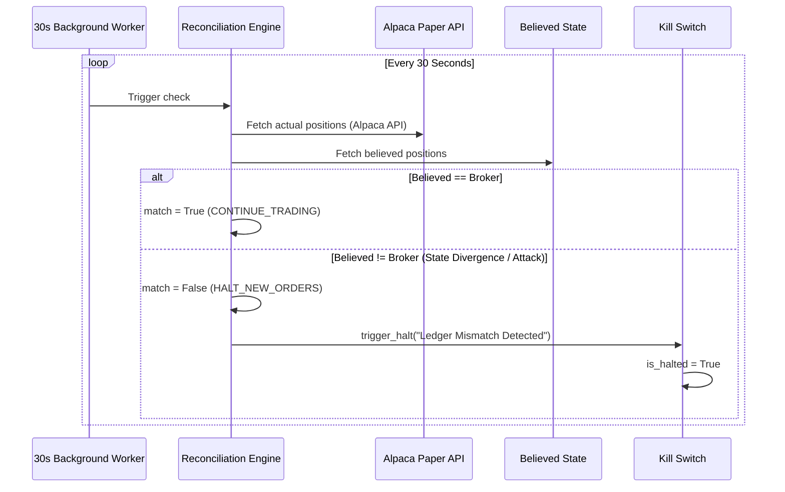

# GlassBox Options — System Workflow & Data Flow

This document details what happens under the hood during system execution, from live market ingestion to cryptographic verification.

---

## 1. Live Decision Pipeline (Step-by-Step)

```
[Alpaca Broker API] 
        │
        ▼ (1. Fetch account balance & option chains)
[Perception Layer] ──> Calculates IV Rank (67.1%), RV (1.67%), VRP (+20.73), Spread (4.01%)
        │
        ▼ (2. Bundles into MarketContext JSON)
[Google Gemini (gemini-3.6-flash)] ──> Evaluates volatility regime & constructs defined-risk structure
        │
        ▼ (3. Emits structured Intent JSON with numeric rationale)
[Deterministic Risk Kernel] ──> Checks Intent against 10 hard limits in config.yaml (Delta, Vega, BP%, Floor)
        │
        ├─────────────────────────────┬─────────────────────────────┐
        ▼ (If APPROVED)                                              ▼ (If REJECTED)
[Alpaca Executor]                                            [Rejection Logger]
        │                                                           │
        ▼ (Places multi-leg order on Alpaca Paper)                  │
[Order Placed (ID: alpaca-order-xxx)]                               │
        │                                                           │
        └─────────────────────────────┬─────────────────────────────┘
                                      ▼ (4. Snapshot Generation)
                          [Canonical JSON Serializer]
                                      │
                                      ▼ (5. SHA-256 Hashing)
                      [Immutable Audit Snapshot (sha256:...)]
                                      │
                                      ▼ (6. Persisted to disk)
                           [verification/audit_trail.jsonl]
```

### Trace of a Real Live Execution (illustrative numbers - actual values vary run to run since they're read live):
1. **Perception**:
   - Spot price for SPY is read from Alpaca's real stock bars (e.g. $761.63).
   - Realized volatility over 30 days is computed from those real closes (e.g. $12.4\%$). Implied volatility comes from Alpaca's live options quote feed for the real listed chain (e.g. $14.6\%$).
   - Volatility Risk Premium is calculated: $\text{VRP} = \text{IV} - \text{RV}$.
   - IV Rank is evaluated against a trailing realized-vol range proxy (see [ARCHITECTURE.md](ARCHITECTURE.md)).
   - VIX is read from CBOE's public daily-history feed.
2. **Reasoning**:
   - `gemini-3.6-flash` receives the `MarketContext`, including a sample of the real listed contracts.
   - Sees IV Rank $> 50\%$ and positive VRP.
   - Selects a high-probability defined-risk structure, e.g. `credit_spread_put`.
   - Generates numeric rationale citing the real values above.
   - Every leg's strike is snapped to the nearest actually-listed contract from the real chain (`reasoning/agent.py::_snap_legs_to_real_contracts`) so it can always be resolved to a tradable symbol.
3. **Risk Kernel Evaluation**:
   - Re-computes maximum loss independently from the real strike widths.
   - Checks buying power allocation against the real account buying power (PASS/FAIL).
   - Checks Vega impact against the real, live-Greeks-derived portfolio vega (PASS/FAIL).
   - Returns `KernelDecision(approved=True, decision="APPROVED")` or `REJECTED` with the exact numeric violation.
4. **Broker Execution**:
   - [alpaca_client.py](file:///c:/hackathone/glassbox%20lab%20ai%20trading%20bot/perception/alpaca_client.py) resolves each leg to its real OCC contract symbol and submits a single real multi-leg combo order (`order_class=MLEG`) to Alpaca paper trading. If any leg can't be resolved to a currently-listed contract, or the broker rejects the order, execution fails closed - it returns `None`, never a fabricated fill.
5. **Cryptographic Mintage**:
   - `create_audit_snapshot()` combines `market_state + account_state + intent_id` into canonical sorted JSON and produces a SHA-256 hash over the real inputs above.
   - Snapshot is written to disk in [audit_trail.jsonl](file:///c:/hackathone/glassbox%20lab%20ai%20trading%20bot/verification/audit_trail.jsonl).

---

## 2. Replay Verification Protocol ("Verify Trade" Button)

When a judge or auditor clicks **"Verify Trade"** on any recorded transaction, two independent verifications execute:

```
                  Stored Snapshot (Order ID / Snapshot ID)
                                      │
                  ┌───────────────────┴───────────────────┐
                  ▼                                       ▼
    [1. Cryptographic Hash Integrity]       [2. Numeric Rationale Verification]
    Recomputes SHA-256 hash over raw        Extracts numeric claims from rationale
    market_state + account_state + intent   (e.g., "IV rank 67.1%", "VRP +20.73pts")
                  │                                       │
                  ▼                                       ▼
    Compares Recomputed vs Stored Hash      Cross-checks against stored snapshot
                  │                                       │
                  ▼                                       ▼
          [✓ INTEGRITY: PASS]                    [✓ CONDITIONS: SUPPORTED]
```

* **Why this matters for judges**: The hash proves the snapshot wasn't altered post-hoc. The condition check proves the LLM's reasoning is grounded in authentic market data.

---

## 3. Automated Reconciliation Loop (Act 2 TradeTrap Defense)



* **Adversarial Resilience**: In research on LLM trading agents (e.g. prompt injection, hallucinated ledger updates), bots place invalid trades based on corrupted internal memory. GlassBox Options detects this divergence autonomously on the next poll and halts trading immediately.
